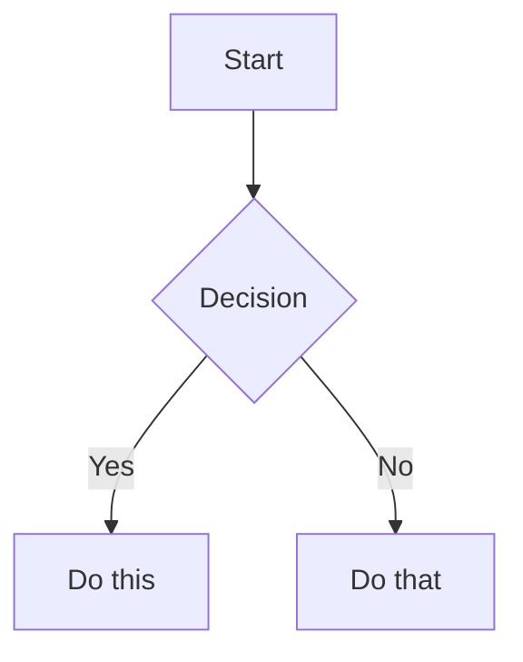

# Documentation System Guide

This guide explains how to work with Vulcan's documentation system.

## Overview

Vulcan uses [VitePress](https://vitepress.dev/) for documentation, which provides:
- Fast development with hot-reload
- Vue 3 powered components
- Markdown-centric with Vue enhancements
- Static site generation for GitHub Pages

## Documentation Dependencies

**The documentation has its own `package.json` in the `docs/` directory.** Both the main application and documentation now use Vue 3, but are kept separate for build isolation.

## Working with Documentation

### Starting the Dev Server

From the project root:
```bash
yarn docs:dev
```

Or work directly in the docs directory:
```bash
cd docs
yarn install  # First time only
yarn dev
```

The server runs at `http://localhost:5173/vulcan/`

### Directory Structure

```
docs/
├── .vitepress/          # VitePress configuration
│   ├── config.js        # Main configuration
│   └── theme/           # Custom theme components
│       ├── index.js     # Theme setup
│       ├── Mermaid.vue  # Mermaid diagram support
│       └── custom.css   # Custom styles
├── package.json         # Docs-specific dependencies
├── yarn.lock           # Dependency lock file
└── [content folders]    # Documentation content
```

## Adding Documentation

### Creating New Pages

1. Create a `.md` file in the appropriate directory
2. Add frontmatter if needed:
   ```yaml
   ---
   title: Page Title
   description: Page description
   ---
   ```
3. Write content using Markdown

### Updating Navigation

Edit `.vitepress/config.js` to add pages to navigation:

```javascript
nav: [
  { text: 'New Section', link: '/new-section/' }
],
sidebar: {
  '/new-section/': [
    {
      text: 'Section Title',
      items: [
        { text: 'Page 1', link: '/new-section/page-1' },
        { text: 'Page 2', link: '/new-section/page-2' }
      ]
    }
  ]
}
```

## Markdown Features

### Standard Markdown

All standard Markdown syntax is supported:
- Headers, paragraphs, lists
- Code blocks with syntax highlighting
- Tables, blockquotes, horizontal rules
- Links and images

### VitePress Extensions

#### Custom Containers

```markdown
::: tip
This is a tip
:::

::: warning
This is a warning
:::

::: danger
This is a danger alert
:::

::: details Click to expand
Hidden content
:::
```

#### Code Line Highlighting

````markdown
```javascript{2,4-5}
const line1 = 'not highlighted'
const line2 = 'highlighted'
const line3 = 'not highlighted'
const line4 = 'highlighted'
const line5 = 'highlighted'
```
````

#### Mermaid Diagrams

````markdown

````

## Building Documentation

### Local Build

```bash
# From project root
pnpm docs:build

# Or from docs directory
cd docs
pnpm build
```

The built site will be in `docs/.vitepress/dist/`.

### CI/CD Build

GitHub Actions automatically builds and deploys on merge to master.

## Deployment

### Automatic Deployment

Documentation automatically deploys when:
- Changes are pushed to `master` branch
- Files in `docs/` directory are modified
- GitHub Actions workflow succeeds

### Manual Deployment

You can manually trigger deployment:
1. Go to Actions tab in GitHub
2. Select "Deploy VitePress Documentation"
3. Click "Run workflow"

## Best Practices

### Content Guidelines

1. **Clear Structure**: Use logical hierarchy with proper headings
2. **Code Examples**: Include practical, runnable examples
3. **Visual Aids**: Add diagrams for complex concepts
4. **Cross-References**: Link to related documentation
5. **Consistency**: Follow established patterns and styles

### File Organization

- `/getting-started/` - New user guides
- `/deployment/` - Deployment and installation
- `/development/` - Developer documentation
- `/api/` - API references
- `/security/` - Security documentation

### Commit Messages

When updating docs:
```bash
git commit -m "docs: update deployment guide with Kubernetes examples"
git commit -m "docs: fix broken links in API reference"
git commit -m "docs: add troubleshooting section"
```

## Troubleshooting

### Common Issues

#### Port Already in Use
VitePress will automatically try the next port:
```
➜  Local:   http://localhost:5174/vulcan/
```

#### Module Not Found Errors
Clean and reinstall dependencies:
```bash
cd docs
rm -rf node_modules yarn.lock
yarn install
```

#### Build Failures
Local builds fail due to Vue conflicts. Use the dev server for local work:
```bash
yarn dev  # Works for development
```

## Future Improvements

Once Vue 3 migration is complete:
1. Merge docs dependencies into main `package.json`
2. Remove separate dependency management
3. Enable local builds
4. Simplify development workflow

## Resources

- [VitePress Guide](https://vitepress.dev/guide/getting-started)
- [Markdown Reference](https://www.markdownguide.org/)
- [Mermaid Diagrams](https://mermaid.js.org/)
- [Vue 3 Documentation](https://vuejs.org/)