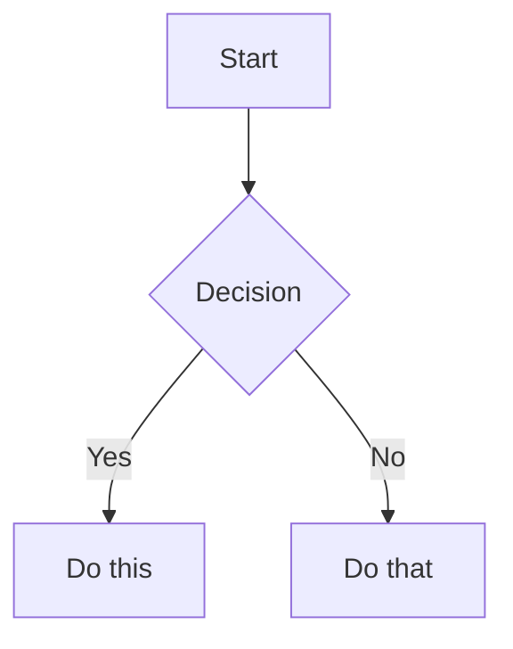

# Documentation System Guide

How to work with Vulcan's documentation.

## Overview

Vulcan uses [VitePress](https://vitepress.dev/) for documentation:
- Fast development with hot-reload
- Vue 3 powered components
- Markdown-centric with Vue enhancements
- Static site generation for GitHub Pages

## Separate Dependencies (Vue 2/3 Isolation)

The documentation has its own `package.json` in `docs/` — separate from the Rails app. This is intentional:

- **Rails app**: Vue 2.7.16 + Bootstrap 4 (in root `package.json`)
- **Documentation**: VitePress with Vue 3 (in `docs/package.json`)

The root `package.json` scripts (`yarn docs:dev`, etc.) handle this transparently — they auto-install docs dependencies before running VitePress. You never need to `cd docs` manually.

## Commands (from project root)

```bash
yarn docs:dev      # Start dev server at http://localhost:5173/vulcan/
yarn docs:build    # Build static site to docs/.vitepress/dist/
yarn docs:preview  # Preview the production build locally
```

## Directory Structure

```
docs/
├── .vitepress/
│   ├── config.js        # Sidebar, nav, VitePress settings
│   └── theme/           # Custom theme (Mermaid, styles)
├── package.json         # Docs-specific dependencies (Vue 3)
├── yarn.lock            # Dependency lock file
├── index.md             # Homepage
├── about.md             # About page
├── api/                 # API documentation
├── deployment/          # Deployment + upgrade guides
├── development/         # Developer documentation (this file)
├── disa-process/        # DISA STIG vendor process
├── getting-started/     # Setup, config, env vars, troubleshooting
├── release-notes/       # Per-version release notes
├── security/            # Security controls + compliance
└── user-guide/          # End-user documentation
```

## Adding Documentation

### Creating New Pages

1. Create a `.md` file in the appropriate directory
2. Add frontmatter if needed:
   ```yaml
   ---
   title: Page Title
   description: Page description
   ---
   ```
3. Write content using Markdown

### Updating Navigation

Edit `.vitepress/config.js` to add pages to the sidebar:

```javascript
{
  text: "Development",
  items: [
    { text: "Setup", link: "/development/setup" },
    { text: "Your New Page", link: "/development/your-page" },
  ],
},
```

Both the top-level nav and the path-specific sidebar sections need to be updated — the config has two sidebar definitions (one for the main nav, one for path-specific).

## Markdown Features

Standard Markdown plus VitePress extensions:

### Custom Containers

```markdown
::: tip
Helpful information
:::

::: warning
Important caveat
:::

::: danger
Critical warning
:::
```

### Mermaid Diagrams

````markdown

```mermaid
graph TD
    A[Start] --> B{Decision}
    B -->|Yes| C[Do this]
    B -->|No| D[Do that]
```
````

## Build Configuration

### Excluded Content

`srcExclude` in `.vitepress/config.js` prevents internal planning docs from being processed:

```javascript
srcExclude: ['**/superpowers/**', '**/plans/**'],
```

These directories contain working documents with raw markdown that Vue's template compiler rejects (embedded YAML, duplicate HTML attributes). They're development artifacts, not published content.

### Build Verification

Always build before committing doc changes:

```bash
yarn docs:build
```

If the build fails, check for:
- Raw HTML in markdown that Vue interprets as template syntax
- Unclosed tags or duplicate attributes
- Files in excluded directories that should stay excluded

## Deployment

### Automatic (GitHub Actions)

Documentation deploys when changes are pushed to `master` or `main` in the `docs/` directory. The `.github/workflows/docs.yml` workflow builds and deploys to GitHub Pages.

### Manual

Trigger via GitHub Actions → "Deploy VitePress Documentation" → "Run workflow".

## Content Guidelines

1. **Source verification** — read the source code before documenting it
2. **Code examples** — include practical, runnable examples from real Vulcan usage
3. **Cross-references** — link to related pages (use relative links: `[setup](setup)`)
4. **No fabrication** — don't document features that don't exist
5. **Keep current** — when code changes, update the docs in the same commit

### Commit Messages

```bash
git commit -m "docs: add upgrade system developer guide"
git commit -m "docs: update env vars for port standardization"
```

## Troubleshooting

### Port Already in Use

VitePress auto-increments:
```
➜  Local: http://localhost:5174/vulcan/
```

### Module Not Found

```bash
yarn docs:build    # Auto-installs deps before building
```

If that fails, manually reinstall:
```bash
cd docs && rm -rf node_modules && yarn install && cd ..
```

### Build Fails on Plan Files

Internal planning docs (`superpowers/plans/`) contain markdown that Vue rejects. They're excluded via `srcExclude` in the VitePress config. If you add new internal docs, add their directory to the exclude list.

## Resources

- [VitePress Guide](https://vitepress.dev/guide/getting-started)
- [Markdown Reference](https://www.markdownguide.org/)
- [Mermaid Diagrams](https://mermaid.js.org/)
