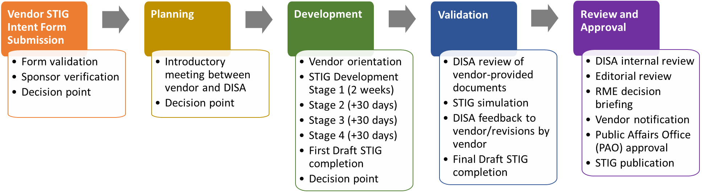

# Vendor STIG Process Guide

**DISA — Version 4, Release 1 — 15 August 2022**

[Download original document (DOCX)](/attachments/U_Vendor_STIG_Process_Guide_V4R1_20220815.docx)

---

## Introduction

The Defense Information Systems Agency (DISA) Standards and Analysis Division plays a critical role in enhancing the security posture of the Department of Defense’s (DOD) security systems through its Security Technical Implementation Guides (STIGs). The STIGs provide DOD and other federal agencies with operational configuration guidance to harden computer systems and protect cyber infrastructure that might otherwise be vulnerable to a malicious computer attack.

DISA has developed a process through which vendors can request to write a STIG for possible publication.

This Vendor Process contains the following major milestones. “Decision points” indicate when DISA will determine if a vendor continues in the process.

To begin the process, the vendor submits the Vendor STIG Intent Form through the DOD Cyber Exchange website at <https://public.cyber.mil/stigs/vendor-process>. DISA validates the information on the form, notifies the vendor if more information is needed, and determines if the vendor will move on to the Planning stage.

## Planning

### Introductory Meeting

The Planning stage kicks off with an introductory meeting between the vendor and DISA. Prior to the meeting, the vendor provides DISA with the following information:

- Marketing material.

- Product website addresses.

- Product usage in the DOD.

- Vendor meeting participants.

- Time zone.

The success of this meeting depends on participation by the correct individuals. Vendor attendees should not be sales representatives but rather a technical team whose members can answer questions about securing the product in line with DOD standards.

The meeting consists of a 15-minute introduction by DISA covering the STIG development process and overview of requirements and a 15-minute presentation by the vendor. The vendor presentation should consist of:

- A demonstration or explanation of the product.

  - Main functional areas that are accessible and configurable.

  - Functional areas that are National Information Assurance Partnership (NIAP) Protection Profile (PP) tested/approved.

- Justification for the STIG.

- The product’s current DOD use cases and density.

### Decision Point

Following the Introductory Meeting, DISA determines the level of need for the proposed STIG and notifies the vendor via email of the decision.

If the decision is to move forward, the vendor enters the Development stage of the process.

## Development

### Vendor Orientation

The STIG development process begins with a vendor orientation, which includes a discussion of:

- Vendor resource availability and timeline.

- Security Requirements Guides (SRGs) applicable to the technology.

- Requirements “Cheat Sheet.”

If vendor resources are not immediately available for STIG development, the process is pushed six months, at which time the vendor is responsible for contacting DISA to restart the process.

If vendor resources are available and the vendor wishes to continue, the process moves to the next stage of development.

### Stage 1 STIG Development

- DISA provides the vendor with a STIG template based on the applicable SRG. This template contains requirements the STIG must address.

- Within two weeks, the vendor returns the STIG template to DISA with 10 requirements completed. This must be a mix of all statuses: Applicable – Configurable, Applicable – Inherently Meets, Applicable – Does Not Meet, and Not Applicable.

- DISA reviews the requirements and either accepts them and notifies the vendor to move forward with development or asks for updates and resubmission.

### Stage 2 STIG Development

- Within 30 days after the DISA decision to proceed, the vendor submits the STIG as a work in progress to DISA for review.

- DISA reviews the STIG and notifies the vendor to move forward with current development or offers feedback on areas for improvement.

### Stage 3 STIG Development

- Within 60 days after the DISA decision to proceed, the vendor submits the STIG as a work in progress to DISA for review.

- DISA reviews the STIG and notifies the vendor to move forward with current development or offers feedback on areas for improvement.

### Stage 4 STIG Development

- Within 90 days after the DISA decision to proceed, the vendor submits the completed initial draft STIG to DISA for review.

- DISA reviews the STIG and takes one of the following actions:

  - Accepts the STIG.

  - Accepts the STIG with time for development.

  - Rejects the STIG.

  - Rejects the STIG with request for revisions.

## Writing the STIG

The vendor will use the technology-specific STIG template, Vendor STIG Process Guide, and Requirements Cheat Sheet provided at the orientation meeting to develop the STIG content. This includes:

- Requirements Analysis.

- Vendor populates the Status column of the spreadsheet.

- Vendor populates the Status Justification column for “Does Not Meet,” “Inherently Meets,” and “Not Applicable” requirements.

- Vendor populates the Mitigation column with mitigation information for “Does Not Meet” requirements.

- Vendor populates the Artifact Description column for “Inherently Meets” requirements.

- Check and Fix Procedure Development.

- Vendor identifies configurable settings relevant to the requirement.

- Vendor populates the Check column with the setting requirements and verification instructions.

- Vendor populates the Fix column with details on how to configure the relevant settings.

The following sections describe in detail the STIG template fields and how they should be completed.

::: warning Formatting
In the spreadsheet, **do not use any enhanced formatting** — no bold, italics, underline, strikethrough, different fonts, or smart (curly) quotes. Plain text only.
:::

### STIG Template Field Descriptions

Fields designated by an asterisk (\*) below are prepopulated and should not be changed.

#### IA Control\*

This is a prepopulated reference to the [National Institute of Standards and Technology (NIST) Special Publication (SP) 800-53] Information Assurance (IA) control from which the requirement is sourced. The STIG developer may wish to read the source material for more information.

#### CCI\*

The Control Correlation Identifier (CCI) enables DOD organizations to trace STIG compliance to IA controls specified by NIST and mandated for federal government agencies.

#### SRGID\*

This is the ID for the SRG requirement. It may also contain identification information for a “parent” SRG document.

#### STIGID

This will be the identifier of the requirement in the STIG. DISA populates the STIGID during finalization. The vendor will not complete this field.

#### SRG Requirement\*

This is a sentence stating the requirement and is prepopulated from the Technology SRG.

#### Requirement

This is a STIG-specific requirement that focuses the scope of the SRG requirement on the product for which the STIG is being written.

Adhere to the following standards when writing the requirements:

- Use the word “must” rather than “should”.

  - *Correct example:* The \[operating system\] **must** protect audit information from unauthorized deletion.

  - *Incorrect example:* The \[operating system\] **should** protect audit information from unauthorized deletion.

- For Applicable-Configurable requirements, replace the generic terminology from the SRG requirement (such as application, operating system, etc.) with the specific name of the technology.

- Use the wording “must be configured to” instead of “must be capable of” or “must have the capability to”.

  - *Correct example:* The \[technology name\] **must be configured to** prevent browsers from saving user credentials.

  - *Incorrect example:* The \[technology name\] **must be capable of** preventing browsers from saving user credentials.

#### SRG VulDiscussion\*

The SRG vulnerability discussion describes the risk of not complying with the requirement. This is prepopulated from the SRG.

#### VulDiscussion

This is a STIG-specific adaptation of the risk and vulnerability information described in the SRG VulDiscussion. The VulDiscussion should address the vulnerability as it affects the product in question. Requirements evaluated to be Not Applicable do not require a VulDiscussion.

Do not use the VulDiscussion field to address specific information about particular settings or products.

The Vulnerability Discussion should not be overly long or detailed, but it should be complete enough to:

- Explain the vulnerability from a security perspective.

- Discuss how it affects the product.

- Include a statement that identifies the risk created if the requirement is not met.

#### Status

Determine the status by analyzing the SRG requirement as it relates to the product for which the STIG is being written.

This is a required field. Select from a drop-down list that contains the following four statuses:

| **Status** | **Description** |
|----|----|
| Applicable – Configurable | The product requires configuration or the application of policy settings to achieve compliance. |
| Applicable – Inherently Meets | The product is compliant in its initial state and cannot be subsequently reconfigured to a noncompliant state. |
| Applicable – Does Not Meet | There are no technical means to achieve compliance. |
| Not Applicable | The requirement addresses a capability or use case that the product does not support. |

**Table: Statuses**

Use the following additional guidance in determining the status:

- If the product can be configured to meet the SRG requirement, the status is **Applicable-Configurable**.

- If the product natively meets the SRG requirement and cannot be reconfigured to be out of compliance, the status is **Applicable – Inherently Meets**.

- If the product **DOES NOT** natively meet the SRG requirement and **CANNOT** be reconfigured to meet the SRG requirement, the status is **Applicable – Does Not Meet**.

- If the product features and functions or overall architecture do not align with the SRG requirement, the status is **Not Applicable**. (For example, if the requirement addresses encryption of removable data storage media but the product does not support removable media, the requirement is Not Applicable.)

The inability to meet an SRG requirement will be used to make residual risk decisions for information systems employing the product.

#### SRG Check\*

The SRG Check content provides a generic approach to assess the SRG requirement. The vendor developing the STIG can reference the SRG Check, as a guide, to create product-specific STIG Check content as described in Section 4.1.11.

#### Check

::: warning Critical Rule — Section 4.1.11
**"Complete this cell only for rows where the status is Applicable – Configurable. Leave it blank for all other status types."** Submitting Check content for non-AC statuses violates DISA formatting requirements.
:::

The Check is used to provide specific instruction on how to validate product configuration settings. It must include any information and procedures necessary for validating the configured value.

The Check should also state:

- What system privileges, if any, are necessary to perform the check.

- Whether the check procedure requires local access or can be performed remotely.

- Whether performing the check impacts system reliability or availability.

If the vendor is leveraging third-party tools to satisfy a requirement, identify in the Check the product and the specific steps to check compliance.

If the product is expected to be compatible with a number of third-party tools, include in the Check general instructions that would enable a systems administrator with reasonable familiarity with the third-party tool to perform the necessary procedure.

For example, if the requirement is to block certain TCP ports on a firewall, a general instruction to this effect may suffice.

##### Check Writing Style

Write the Check so the user can easily follow the steps to assess and determine compliance.

- If the check procedure is not applicable for a specific condition, state that at the top of the Check. (Refer to “Check text example” below.)

- Do not restate the requirement in the Check.

- Do not include steps to alter values or settings.

- Do not use words such as “should,” shall,” or “please.”

- Use action verbs such as “verify,” “navigate,” “identify,” “type,” “obtain,” etc.

- Give exact steps to test compliance with the requirement.

- For checks that require a sequence of actions, use numbered steps as shown below:

> 1. Log on to…
>
> 2. Open the…
>
> 3. Click….
>
> 4. Determine…

- Include a “finding” statement written as: “If….this is a finding”.

> **Check text example**:
>
> If Bluetooth connectivity is required to facilitate use of approved external devices, this is not applicable.
>
> To determine if any hardware components for Bluetooth are loaded in the system, run the following command:
>
> \# sudo kextstat \| grep -i Bluetooth
>
> If a result is returned, this is a finding.

In some cases, determining when an item is NOT a finding might be appropriate.

> **Check text example:**
>
> If the "xyz" parameter is set to "5", this is not a finding.

When using a command to inspect the status of a host, listing example output can be helpful. The output must comply with STIG requirements unless an example of a failure is needed and is clearly explained.

> **Check text example:**
>
> Find the file systems that contain the directories being exported with the following command:
>
> \# cat /etc/fstab \| grep nfs
>
> UUID=e06097bb-cfcd-437b-9e4d-a691f5662a7d /store nfs rw,nosuid 0 0
>
> If a file system found in "/etc/fstab" refers to NFS and does not have the "nosuid" option set, this is a finding.

#### SRG Fix\*

The SRG Fix content provides a generic approach to bringing the product into compliance with the SRG requirement. The vendor developing the STIG can reference the SRG Fix, as a guide, to create product-specific STIG Fix content as described in Section 4.1.13.

#### Fix

::: warning Critical Rule — Section 4.1.13
**"Complete this cell only for rows where the status is Applicable – Configurable. Leave it blank for all other statuses."** Same rule as Check content above.
:::

The Fix is used to provide specific instructions on how to configure the product to comply with the requirement.

After steps in the Fix text are implemented, the resulting system state should be the same no matter how many times the instructions are followed.

##### Fix Writing Style

When writing the Fix content, the vendor must include all steps needed to configure the product to comply with the requirement.

- Do not use general language. When writing the criteria statement in the Fix text, be specific. Use the exact steps to take to bring the product into compliance with the requirement.

- Do not restate the requirement in the Fix.

- In the Fix procedures, do not use such words as “should,” shall,” or “please.”

- Use action verbs such as “ensure,” “configure,” “set,” “select,” etc.

- For Fix procedures that require a sequence of actions, use numbered steps as shown below:

> 1. Log on to…
>
> 2. Open the…
>
> 3. Click the….
>
> 4. Ensure…

- Do not include a finding statement in the Fix.

#### Severity

The Severity Category Code (CAT) is an indicator of the risk associated with noncompliance.

The vendor can adjust the severity based on the definitions below.

DOD subject matter experts (SMEs) will verify the CAT value after considering the impact of noncompliance in the overall security architecture of the product and the environment in which it is expected to operate.

The CAT is a required field selected from a drop-down list that contains the following three codes:

|  | **DISA Category Code Guidelines** |
|----|----|
| CAT I | Any vulnerability, the exploitation of which will **directly and immediately** result in loss of confidentiality, availability, or integrity. |
| CAT II | Any vulnerability, the exploitation of which **has a potential** to result in loss of confidentiality, availability, or integrity. |
| CAT III | Any vulnerability, the existence of which **degrades measures** to protect against loss of confidentiality, availability, or integrity. |

**Table: Vulnerability Severity Category Code Definitions**

::: warning Severity Rules
- Requirements evaluated to be **Not Applicable do not require a severity** — leave blank.
- The severity for **Applicable – Does Not Meet must reflect the risk BEFORE any mitigation** — do not downgrade the CAT based on the mitigation you provide.
:::

#### Mitigation

The Mitigation offers a method for minimizing risk. Mitigations do not eliminate the need for the requirement.

::: info Required Field
The **Mitigation** field **must be populated** if the status of the requirement is **Applicable – Does Not Meet**. This is the only status that uses this field.
:::

After the mitigation, include a summary statement to address any impact to the overall risk associated with this requirement.

> **Example summary statements**:

- With the implementation of this mitigation, the overall risk can be decreased to a CAT \[II or III\].

- With the implementation of this mitigation, the overall risk is fully mitigated.

- Although the listed mitigation is supporting the security function, it is not sufficient to reduce the residual risk of this requirement.

An “Applicable – Does Not Meet” vulnerability may be fully mitigated by the application of another STIG check or by the underlying operating system. In these instances, include a statement in the Mitigation as shown in the example below.

::: tip Cross-STIG Mitigation Examples
- “This requirement is fully mitigated by the Apache Server 2.4 Windows Server STIG. The Apache Web Server accounts not used by installed features (e.g., tools, utilities, specific services) must not be created and must be deleted when the Apache web server feature is uninstalled. (AS24-W1-000280)”
- “This requirement is fully mitigated by the underlying operating system. (WN16-SO-000430)”
:::

::: info Vulcan Feature
In Vulcan, nesting a rule via the Satisfies panel auto-populates the status (ADNM), status justification, and mitigation text per the DISA template above.
:::

#### Artifact Description

Populate this information for requirements that have a status of Applicable – Inherently Meets. The Artifact Description describes the artifacts or substantiating information that shows how the product inherently meets the requirement.

All self-certification claims must be accompanied by supporting vendor documentation, which taken as a whole, provides DISA with reasonable assurance that the particular requirement has been met.

This field provides citations to the documentary evidence that describe how each requirement is satisfied. Examples of artifacts include:

- A test report describing the test procedures used to verify compliance and corresponding results, including the specific version of tools used to test and date of test.

- A published administrative manual or configuration guide explaining how compliance can be achieved.

- An attestation from the product developer that the product is compliant, accompanied by a brief statement describing the technical means by which compliance is achieved.

- Steps to verify the product cannot be configured to be out of compliance with the requirement.

::: warning Insufficient Evidence
Blogs and email messages are **not sufficient documentation** to support an Applicable – Inherently Meets status. DISA requires published manuals, test reports, or letters of attestation.
:::

#### Status Justification

::: info Required for Three Statuses
This information **must be populated** for requirements with status: **Not Applicable**, **Applicable – Does Not Meet**, or **Applicable – Inherently Meets**. Only Applicable – Configurable does not require Status Justification.
:::

**For requirements that have a status of Not Applicable:**

- Explain in the Status Justification text why the requirement is not applicable.

- The most common explanations are that the requirements concern a capability that is not present on the device (e.g., encryption of removable data storage media where the product does not support removable media) or the requirement pertains to an operational environment in which the product will not be placed (e.g., the requirement applies to classified processing when the product is intended only for unclassified applications).

**For requirements that have a status of Applicable – Does Not Meet:**

- Explain in the Status Justification text what function or feature is not present.

- If some part of the requirement is achievable, the Status Justifications should explain what part of the requirement is unmet and what is met (e.g., the system can lock an account after certain failed logon attempts, but these failures are not limited to a specific window of time).

- If no part of the requirement can be fulfilled, note this information.

- Describe the residual risk after any mitigation is applied.

**For requirements that have a status of Applicable – Inherently Meets**

- List in the Status Justification text the specific feature of the product that supports this requirement and that cannot be changed.

- Note the type of evidence used to establish compliance (e.g., test report, vendor documentation, or vendor attestation).

### STIG Template Additional Rows

In some cases, multiple configuration settings may be needed to achieve compliance with a single requirement. If this is the case, insert multiple rows into the spreadsheet by:

- Copying the content from the row that contains the requirement.

- Inserting a duplicate row.

- Updating with the specific content.

The IA Control, CCI, SRG ID, SRG Requirement, SRG Check, etc., for the new line must contain the information from the original requirement.

Additional rows are also used when some attack vectors related to a single requirement can be addressed while others cannot. If this is the case, add different STIG-specific requirements to the template and select appropriate statuses for each. As noted above, each new line will retain the same, unchanged items from the root SRG requirement, including IA Control, CCI, SRG ID, SRG Requirement, SRG Check, etc.

#### Security Features Without Associated SRG Requirement

In some situations, security features in the product will not seem to align with any SRG requirement. If the vendor recommends specific configuration settings as a security best practice, use CCI-000366 to include that information.

::: tip CCI-000366
CCI-000366 is specifically intended for this purpose. Copy the line in the template containing this CCI as a starting point for adding best practice requirements to the spreadsheet. In Vulcan, this maps to creating additional rules under the CCI-000366 SRG requirement.
:::

## Validation

After the vendor completes STIG development, the first draft STIG will move to the STIG Validation stage. The steps in this stage assess the accuracy of the Check and Fix instructions on a system, evaluate the requirements in the STIG compared to those of the SRG, and validate additional documentation.

### STIG Review

The DISA SME starts with a high-level review of the package. This includes determining the completeness and rationale of each requirement’s status, along with any associated justifications.

### Transition

Once the package is considered complete and is ready for simulation, a transition meeting will be held with the vendor, DISA SME, and a Technology SME. From this point on, the Technology SME will complete the STIG Process, but the vendor may be called on for STIG-related questions.

### STIG Simulation

The Technology SME develops a test plan to validate the STIG content’s accuracy in determining what is a finding and what is not a finding and in bringing a system into compliance.

#### STIG Simulation on Product

During the STIG validation, the vendor may be called on for questions related to the setup of the product or the STIG content submitted. The Technology SME will document the outcome of the testing for each requirement.

The Technology SME will work with the vendor to address any items that are found to be technically incorrect or need substantial rework.

#### Access to the Vendor’s Product

To perform STIG simulation, DISA will require access to the software for which a STIG is being developed. This can be accomplished in a variety of ways:

- Vendor lends the software to DISA; this will require the vendor to complete a product loan agreement.

- Vendor provides an environment at either its site or another DOD site, and DISA uses that environment for the validation.

- Vendor provides a solution that allows the SME to access the environment remotely.

DISA is open to exploring other options based on the situation.

#### Product Loan Agreement

This form (available upon request) is used as an agreement between DISA and a vendor to allow DISA to use hardware and software owned or licensed by the vendor for STIG testing and evaluation. This is required if the product will be used in the DISA lab. Do not update the language in the document.

### Review of Vendor-Provided Documents

DISA may require other artifacts, in addition to the STIG content, to properly evaluate the entire package.

#### Published Manual

If a product’s ability to fulfill a requirement is determined to be Applicable – Inherently Meets and the published description of this feature is used as an artifact, the DISA SME will validate this reference material. The SME will verify, for the specific product(s) and version(s) within the scope of the STIG, that the documented material establishes that the requirement is fulfilled by default and this state cannot be changed.

Relevant reference material may include citing specific sections of published configuration guides, instructional books, or administrative manuals, and the citation must be specific regarding applicable sections, charts, or graphs within the material.

#### Test Report

If a product’s ability to fulfill a requirement deemed Applicable – Inherently Meets has been independently verified, the SME will inspect the test report to ensure the proper version of the software was used and the testing procedure demonstrates compliance.

#### Letter of Attestation

A Letter of Attestation is required for any items that have a status of Applicable – Inherently Meets but for which supporting evidence is not documented. A template letter is available upon request.

## Review and Approval

The Review and Approval stage is the last milestone in the vendor STIG process. It includes the following steps:

- DISA Internal Reviews.

- Technology SME develops a formal compliance report and a briefing for the DISA Authorizing Official.

- Style Guide Review.

- Materials are reviewed internally within DISA.

- Vendor and DISA collaborate on updates if needed.

- Decision Brief.

- Materials are presented to the DISA Authorizing Official.

- DISA AO Approval.

- DISA Authorizing Official approves the STIG.

- DISA Authorizing Official may limit the use of a product within certain environments or require specific mitigations for its use depending on the risks associated with the use of the product.

  - Any restrictions on use may be annotated in the signature memo upon approval of the STIG.

- Vendor Notification.

- DISA shares the outcome of the Decision Brief with the vendor.

- Vendor and DISA collaborate on updates if needed.

- STIG Publication.

- STIG (Applicable – Configurable requirements), along with a DISA-provided overview document, is sent to the DISA Public Affairs Office for review and approval.

- STIG (Applicable – Configurable requirements), along with a DISA-provided overview document, is published.

- STIG (Applicable – Configurable requirements) and overview document are publicly available on the Cyber Exchange website.

- STIG requirements (Not Applicable, Applicable – Inherently Meets, or Applicable – Does Not Meet), along with the compliance report, are made available to Authorizing Officials upon request for risk assessment purposes because the data is considered Controlled Unclassified Information (CUI).

::: info Publication Model
- **Public STIG** (Cyber Exchange): Only Applicable – Configurable requirements are published.
- **CUI Package** (Authorizing Officials): NA, AIM, and ADNM requirements with the compliance report are available upon request — this data is Controlled Unclassified Information.
:::

## Disclaimer

The existence of a STIG does not equate to DOD approval for the procurement or use of a product.

STIGs provide configurable operational security guidance for products being used by the DOD. STIGs, along with vendor confidential documentation, also provide a basis for assessing compliance with Cybersecurity controls/control enhancements, which supports system Assessment and Authorization (A&A) under the DOD Risk Management Framework (RMF). DOD Authorizing Officials may request available vendor confidential documentation for a product that has a STIG for product evaluation and RMF purposes from disa.stig_spt@mail.mil. This documentation is not published for general access to protect the vendor’s proprietary information.

DOD Authorizing Officials have the purview to determine product use/approval in accordance with (IAW) DOD policy and through RMF risk acceptance. Inputs into acquisition or preacquisition product selection include such processes as:

- National Information Assurance Partnership (NIAP) evaluation for National Security Systems (NSS) (<https://www.niap-ccevs.org/>) IAW CNSSP \#11

- National Institute of Standards and Technology (NIST) Cryptographic Module Validation Program (CMVP) (<https://csrc.nist.gov/groups/STM/cmvp/>) IAW Federal/DOD mandated standards

- DOD Unified Capabilities (UC) Approved Products List (APL) (<https://www.disa.mil/network-services/ucco>) IAW DoDI 8100.04

## Spreadsheet Field Cross-Reference

The table below identifies fields in the STIG template and defines how they are named in the STIG as it will be viewed from Cyber Exchange.

| **Spreadsheet** | **STIG Viewer** |
|----|----|
| IA | NA |
| CCI | CCI/CCI ID |
| SRGID | Rule Name |
| STIGID | STIG ID/Vul ID |
| SRG Requirement | NA |
| Requirement | Rule Title |
| SRG VulDiscussion | NA |
| VulDiscussion | Discussion |
| Status | NA (only Applicable – Configurable requirements are published) |
| SRG Check | NA |
| Check | Check Text |
| SRG Fix | NA |
| Fix | Fix Text |
| Severity | Severity |
| Mitigation | Mitigation Control |
| Artifact Description | NA |
| Status Justification | NA |

**Table: Field Name Cross-Reference**
  [National Institute of Standards and Technology (NIST) Special Publication (SP) 800-53]: https://csrc.nist.gov/publications/detail/sp/800-53/rev-5/final
