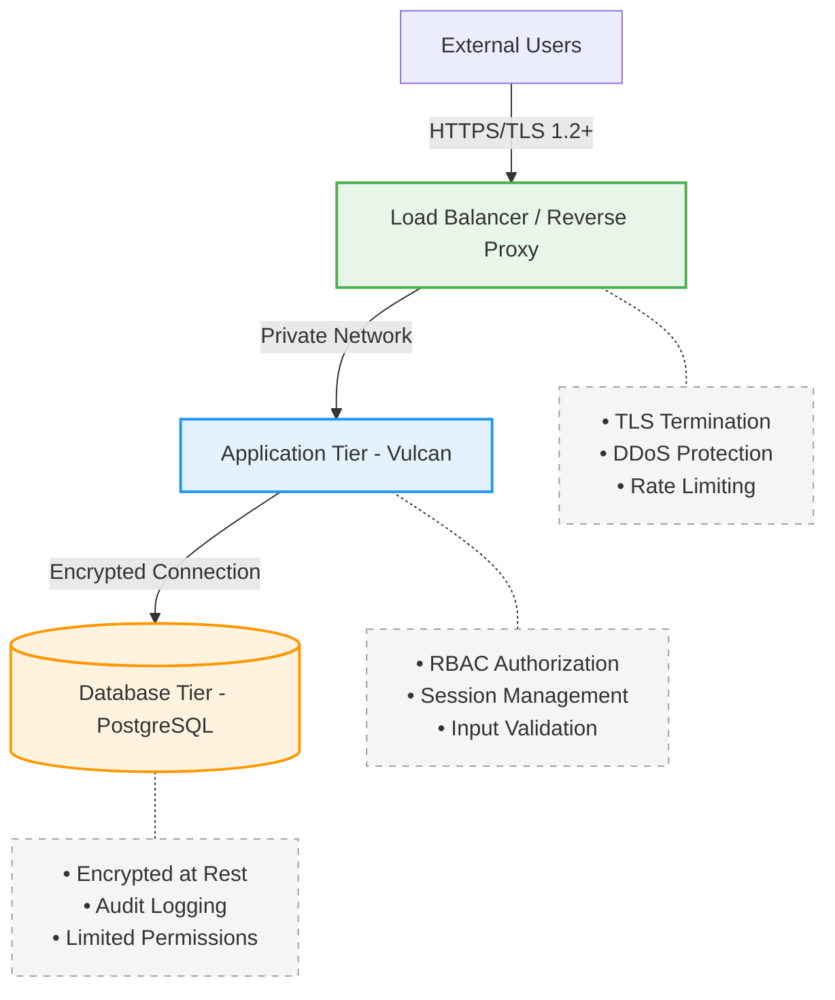

# Security Compliance Guide

## Overview

Vulcan implements comprehensive security controls aligned with **NIST SP 800-53 Revision 5** and the **Application Security & Development STIG**. This guide provides practical implementation details and configuration requirements for deploying Vulcan in compliance with federal security standards.

## Quick Start Security Configuration

For organizations requiring immediate compliance, apply these essential settings:

```bash
# Core Security Settings
export VULCAN_SESSION_TIMEOUT=10m              # 10 minutes (STIG requirement - default is 1h)
export VULCAN_WELCOME_TEXT="AUTHORIZED USE ONLY. By accessing this system, you agree to comply with all organizational security policies. All activities are monitored and logged."
export RAILS_FORCE_SSL=true                    # Force HTTPS
export RAILS_ENV=production                    # Production mode
export SECRET_KEY_BASE=$(rails secret)         # Generate secure key

# Authentication (Choose One)
# Option 1: OIDC/SAML
export VULCAN_ENABLE_OIDC=true
export VULCAN_OIDC_ISSUER_URL=https://your-idp.example.com
export VULCAN_OIDC_CLIENT_ID=vulcan
export VULCAN_OIDC_CLIENT_SECRET=<secure-secret>

# Option 2: LDAP
export VULCAN_ENABLE_LDAP=true
export VULCAN_LDAP_HOST=ldap.example.com
export VULCAN_LDAP_PORT=636
export VULCAN_LDAP_BASE="dc=example,dc=com"
```

## Security Architecture

### Defense in Depth Strategy



## Control Implementation Details

### 🔐 Access Control (AC)

#### Account Management (AC-02)

**What's Required:** Automated account lifecycle management with audit trails

**How Vulcan Implements It:**
- **External Integration:** Leverages your organization's existing identity provider (LDAP, OIDC, GitHub OAuth)
- **Local Account Management:** Admin interface for manual account control when needed
- **Audit Trail:** All account actions logged with timestamp and user ID

**Your Action Items:**
✅ Configure external authentication provider  
✅ Disable local registration in production  
✅ Document account provisioning procedures  

#### Session Management (AC-12)

**What's Required:** Automatic session termination after inactivity

**How Vulcan Implements It:**
- Configurable timeout via `VULCAN_SESSION_TIMEOUT`
- Secure session cookies with Rails session management
- Manual logout capability with session invalidation

**Configuration:**
```bash
# STIG Requirements — accepts suffixes (10m, 900s) or plain numbers
VULCAN_SESSION_TIMEOUT=10m     # Required: 10 min for admin, 15 min for users
                               # Default: 1h (1 hour) if not set
                               # Note: Single timeout for all user types
                               # Formats: 30s, 15m, 1h, or plain (900 = seconds)
```

⚠️ **Known Gaps:**
- Logout confirmation message (Issue #635) - In development

#### System Use Notification (AC-08)

**What's Required:** Display approved system use notification before granting access. Retain the notification until users acknowledge the usage conditions and take explicit action to log on.

**Control Intent:** AC-8 targets the *logon interface* — the authentication event, not every HTTP request. Per the NIST SP 800-53 Rev 5 discussion: *"System use notifications can be implemented using messages or warning banners displayed before individuals log in to systems. System use notifications are used only for access via logon interfaces with human users."* The obligation is satisfied once per authentication session. Page refreshes, navigation, and tab switching within an active session do not require re-display.

**How Vulcan Implements It:**

Vulcan provides three complementary mechanisms:

1. **Welcome Text** — Customizable text on the login page via `VULCAN_WELCOME_TEXT`
2. **Classification Banner** — Persistent top/bottom banner on every page showing system sensitivity level (e.g., UNCLASSIFIED, CUI). Configured via `VULCAN_BANNER_ENABLED`, `VULCAN_BANNER_TEXT`, `VULCAN_BANNER_BACKGROUND_COLOR`, `VULCAN_BANNER_TEXT_COLOR`. Server-rendered (works without JavaScript).
3. **Consent Modal** — Blocks access until user acknowledges terms of use. Supports Markdown content. Acknowledgment is tracked server-side in the Rails session (not browser localStorage), tying consent to the authentication lifecycle per AC-8. Configured via `VULCAN_CONSENT_ENABLED`, `VULCAN_CONSENT_VERSION`, `VULCAN_CONSENT_TITLE`, `VULCAN_CONSENT_CONTENT`, `VULCAN_CONSENT_TTL`.

**Consent Flow (AC-8 a/b):**

1. User navigates to login page → consent modal blocks all interaction
2. User reads notice and clicks "I Agree" → `POST /consent/acknowledge` stores timestamp in Rails session (server-side)
3. User submits login credentials → Devise authenticates and resets session (fixation protection) → Vulcan preserves consent timestamp across the reset
4. User accesses app → `consent_required?` returns false → no modal
5. On logout, session timeout, or browser close → session cleared → consent required again on next visit

**Per-session acknowledgment is the standard government implementation pattern.** Hard refreshes and page navigation within an active session do not re-trigger the modal because the Rails session (and the consent timestamp within it) persists across requests. The modal only re-appears when the session itself ends.

::: tip Configurable TTL
`VULCAN_CONSENT_TTL=0` (default) means per-session — consent expires when the session ends. Organizations requiring less frequent prompting can set a duration (e.g., `24h`, `8h`, `30m`). Per-session is the DoD-compliant default.
:::

**Configuration:**
```bash
# Classification Banner (visible on every page)
export VULCAN_BANNER_ENABLED=true
export VULCAN_BANNER_TEXT="UNCLASSIFIED"
export VULCAN_BANNER_BACKGROUND_COLOR="#007a33"
export VULCAN_BANNER_TEXT_COLOR="#ffffff"

# Consent Modal (must acknowledge before use)
export VULCAN_CONSENT_ENABLED=true
export VULCAN_CONSENT_VERSION=1
export VULCAN_CONSENT_TITLE="Terms of Use"
export VULCAN_CONSENT_CONTENT="By using this system you agree to the **acceptable use policy**."
export VULCAN_CONSENT_TTL=0    # 0 = per-session (DoD default)

# Welcome Text (login page)
export VULCAN_WELCOME_TEXT="AUTHORIZED USE ONLY. All activities are monitored."
```

See [Configuration](/getting-started/configuration) for full details including color codes for standard classification levels.

**References:**
- [NIST SP 800-53 Rev 5 — AC-8](https://csf.tools/reference/sp800-53/r5/ac/ac-8/) — Full control text and discussion
- [NIST Cybersecurity & Privacy Reference Tool (CPRT)](https://csrc.nist.gov/projects/cprt) — Authoritative control catalog
- [DISA ASD STIG V-222434 / V-222435 / V-222436](https://public.cyber.mil/stigs/) — Application Security and Development STIG checks for AC-8 a, b, and c

### 📝 Audit & Accountability (AU)

#### What Gets Logged

| Event Type | Information Captured | Retention |
|------------|---------------------|-----------|
| **Authentication** | User ID, IP, Success/Failure, Timestamp | 90 days minimum |
| **Authorization** | User ID, Resource, Action, Decision | 90 days minimum |
| **Data Changes** | User ID, Before/After Values, Timestamp | 1 year minimum |
| **Admin Actions** | User ID, Action, Target, Result | 1 year minimum |
| **System Events** | Service Start/Stop, Errors, Config Changes | 30 days minimum |

#### Log Format

```json
{
  "timestamp": "2024-10-11T14:30:00Z",
  "level": "INFO",
  "user_id": "user@example.com",
  "session_id": "abc123",
  "ip_address": "192.168.1.100",
  "method": "POST",
  "path": "/api/projects/123",
  "status": 200,
  "message": "Project updated successfully",
  "duration_ms": 145
}
```

#### Database Audit Configuration

Enable comprehensive database auditing with pgAudit:

```sql
-- Install and configure pgAudit extension
CREATE EXTENSION IF NOT EXISTS pgaudit;

-- Set audit parameters
ALTER SYSTEM SET pgaudit.log = 'ALL';
ALTER SYSTEM SET pgaudit.log_catalog = off;
ALTER SYSTEM SET pgaudit.log_parameter = on;
ALTER SYSTEM SET pgaudit.log_statement_once = on;
ALTER SYSTEM SET pgaudit.log_relation = on;

-- Apply configuration
SELECT pg_reload_conf();
```

### 🔑 Identification & Authentication (IA)

#### Supported Authentication Methods

| Method | MFA Support | PIV/CAC | SSO | Recommendation |
|--------|------------|---------|-----|----------------|
| **OIDC/SAML** | ✅ Yes | ✅ Yes | ✅ Yes | **Preferred** for enterprise |
| **LDAP/AD** | ⚠️ Via LDAP | ❌ No | ✅ Yes | Good for on-premise |
| **GitHub OAuth** | ✅ Yes | ❌ No | ✅ Yes | Good for development teams |
| **Local Accounts** | ❌ No | ❌ No | ❌ No | Admin/emergency only |

#### OIDC Configuration Example

```yaml
# config/vulcan.yml
oidc:
  enabled: true
  issuer_url: https://login.example.com
  client_id: vulcan-prod
  client_secret: <%= ENV['OIDC_SECRET'] %>
  scope: "openid profile email"
  
  # Advanced Settings
  discovery: true                    # Auto-discover endpoints
  response_type: "code"              # Authorization code flow
  prompt: "select_account"           # Force account selection
  max_age: 3600                      # Force re-auth after 1 hour
  
  # Attribute Mapping
  uid_field: "preferred_username"
  email_field: "email"
  name_field: "name"
```

#### Password Complexity (IA-05)

**What's Required:** Enforce password complexity meeting organizational standards

**How Vulcan Implements It:**
- Configurable count-based validator: minimum length, uppercase, lowercase, numbers, special characters
- Default policy follows DoD "2222" standard: 15 chars, 2 of each character type
- Real-time checklist in the UI shows compliance as user types
- OmniAuth users (OIDC, LDAP, GitHub) skip complexity validation — their passwords are managed externally
- All thresholds configurable via environment variables

**Configuration:**
```bash
export VULCAN_PASSWORD_MIN_LENGTH=15       # Default: 15
export VULCAN_PASSWORD_MIN_UPPERCASE=2     # Default: 2
export VULCAN_PASSWORD_MIN_LOWERCASE=2     # Default: 2
export VULCAN_PASSWORD_MIN_NUMBER=2        # Default: 2
export VULCAN_PASSWORD_MIN_SPECIAL=2       # Default: 2
```

See [Configure Password Policy](/getting-started/configuration#configure-password-policy) for details.

#### Admin Account Protection (AC-06)

**What's Required:** Prevent unauthorized privilege escalation and ensure admin continuity

**How Vulcan Implements It:**
- **Last-admin protection**: The system prevents demoting or deleting the only admin user, ensuring at least one administrator always exists
- **Admin bootstrap**: Three methods to create the initial admin account (env vars, first-user-admin, rake task)
- **SMTP-aware password tools**: When SMTP is unavailable, admins can generate reset links or set passwords directly — email-dependent forms show a "contact your admin" message instead of silently failing

### 🛡️ System & Communications Protection (SC)

#### TLS Configuration

**Minimum Requirements:**
- TLS 1.2 or higher
- Strong cipher suites only
- Valid certificates from trusted CA
- HSTS enabled with 1-year max-age

**NGINX Configuration:**
```nginx
server {
    listen 443 ssl http2;
    server_name vulcan.example.com;
    
    # TLS Configuration
    ssl_protocols TLSv1.2 TLSv1.3;
    ssl_ciphers ECDHE-ECDSA-AES128-GCM-SHA256:ECDHE-RSA-AES128-GCM-SHA256:ECDHE-ECDSA-AES256-GCM-SHA384:ECDHE-RSA-AES256-GCM-SHA384;
    ssl_prefer_server_ciphers off;
    ssl_session_cache shared:SSL:10m;
    ssl_session_timeout 10m;
    ssl_stapling on;
    ssl_stapling_verify on;
    
    # Security Headers
    add_header Strict-Transport-Security "max-age=31536000; includeSubDomains; preload" always;
    add_header X-Frame-Options "DENY" always;
    add_header X-Content-Type-Options "nosniff" always;
    add_header X-XSS-Protection "1; mode=block" always;
    add_header Content-Security-Policy "default-src 'self'; script-src 'self' 'unsafe-inline'; style-src 'self' 'unsafe-inline';" always;
    
    # Rate Limiting
    limit_req zone=vulcan_api burst=20 nodelay;
    limit_req_status 429;
    
    location / {
        proxy_pass http://vulcan_backend;
        proxy_set_header Host $host;
        proxy_set_header X-Real-IP $remote_addr;
        proxy_set_header X-Forwarded-For $proxy_add_x_forwarded_for;
        proxy_set_header X-Forwarded-Proto $scheme;
    }
}
```

#### Input Security Hardening (SI-10)

**What's Required:** Check validity of information inputs

**How Vulcan Implements It:**

| Protection | Implementation | Scope |
|-----------|---------------|-------|
| **XXE Prevention** | `NONET` flag on all XML parsers (Nokogiri + HappyMapper) | XCCDF uploads |
| **File Size Limits** | `before_action` validation: 50 MB XML, 100 MB ZIP, 50 MB spreadsheet | All uploads |
| **Content-Type Validation** | File extension whitelist per endpoint (.xml, .zip, .xlsx/.csv) | All uploads |
| **Rate Limiting** | rack-attack: 5 login attempts/min/IP, 10 uploads/min/IP | Login + uploads |
| **Input Length Limits** | ActiveRecord validations on Project/Component metadata fields | Database writes |

**Configuration:**
Rate limiting is enabled by default. Thresholds can be adjusted in `config/initializers/rack_attack.rb`.

## Deployment Configurations

### Production Deployment Checklist

#### Pre-Deployment
- [ ] Security review completed
- [ ] Penetration testing performed
- [ ] STIG compliance validated
- [ ] Backup procedures tested
- [ ] Incident response plan documented

#### Application Configuration
- [ ] Production environment variables set
- [ ] TLS certificates installed and valid
- [ ] Session timeout configured (≤10 minutes)
- [ ] Welcome banner configured
- [ ] External authentication enabled
- [ ] Local registration disabled
- [ ] Debug mode disabled
- [ ] Error messages sanitized

#### Infrastructure Security
- [ ] Network segmentation implemented
- [ ] Firewall rules configured (allow only 443)
- [ ] Database on separate network segment
- [ ] Load balancer configured with TLS
- [ ] DDoS protection enabled
- [ ] Rate limiting configured
- [ ] WAF rules applied

#### Monitoring & Logging
- [ ] Centralized logging configured
- [ ] Log retention policies set
- [ ] SIEM integration tested
- [ ] Alert rules configured
- [ ] Audit log review process established

### Container Security

```dockerfile
# Secure Dockerfile Example
FROM registry.access.redhat.com/ubi9/ruby-33:1 AS production

# Security: Run as non-root user
RUN groupadd -r app && useradd -r -g app app

# Security: Install only required packages
RUN dnf install -y \
        postgresql \
        nodejs && \
    dnf clean all && \
    rm -rf /var/cache/dnf

# Security: Set secure permissions
WORKDIR /app
COPY --chown=app:app . .

# Security: No secrets in image
RUN bundle config set --local without 'development test' && \
    bundle install --jobs 4 --retry 3

# Security: Run as non-root
USER app

# Security: Health check
HEALTHCHECK --interval=30s --timeout=3s --start-period=5s --retries=3 \
    CMD curl -f http://localhost:3000/health || exit 1

# Security: Minimal exposure
EXPOSE 3000
CMD ["bundle", "exec", "puma", "-C", "config/puma.rb"]
```

### Kubernetes Security

```yaml
apiVersion: apps/v1
kind: Deployment
metadata:
  name: vulcan
spec:
  template:
    spec:
      # Security Context
      securityContext:
        runAsNonRoot: true
        runAsUser: 1000
        fsGroup: 1000
        
      containers:
      - name: vulcan
        image: mitre/vulcan:latest
        
        # Security Settings
        securityContext:
          allowPrivilegeEscalation: false
          readOnlyRootFilesystem: true
          capabilities:
            drop:
              - ALL
        
        # Resource Limits
        resources:
          limits:
            memory: "1Gi"
            cpu: "500m"
          requests:
            memory: "512Mi"
            cpu: "250m"
        
        # Liveness/Readiness
        livenessProbe:
          httpGet:
            path: /health
            port: 3000
          initialDelaySeconds: 30
          periodSeconds: 10
          
---
# Network Policy
apiVersion: networking.k8s.io/v1
kind: NetworkPolicy
metadata:
  name: vulcan-netpol
spec:
  podSelector:
    matchLabels:
      app: vulcan
  policyTypes:
  - Ingress
  - Egress
  ingress:
  - from:
    - podSelector:
        matchLabels:
          app: nginx
    ports:
    - port: 3000
  egress:
  - to:
    - podSelector:
        matchLabels:
          app: postgres
    ports:
    - port: 5432
```

## Monitoring & Incident Response

### Security Metrics Dashboard

Monitor these key security indicators:

| Metric | Threshold | Alert Level | Response |
|--------|-----------|-------------|----------|
| Failed login attempts | >5 in 15 min | High | Lock account, investigate |
| Privilege escalation attempts | Any | Critical | Immediate investigation |
| Mass data export | >1000 records | Medium | Review and validate |
| Configuration changes | Any | Low | Log and review daily |
| New admin accounts | Any | High | Verify authorization |
| Unusual access patterns | Deviation >3σ | Medium | Investigate anomaly |

### Incident Response Playbook

#### 1. Detection & Analysis
```bash
# Check recent authentication failures
grep "authentication_failed" /var/log/vulcan/production.log | tail -100

# Review admin actions
grep "admin_action" /var/log/vulcan/audit.log | tail -50

# Check for data exfiltration
grep "export\|download" /var/log/vulcan/access.log | awk '{print $1}' | sort | uniq -c
```

#### 2. Containment
```bash
# Disable compromised account
rails console
User.find_by(email: 'compromised@example.com').lock_access!

# Block IP address
iptables -A INPUT -s <malicious_ip> -j DROP

# Revoke all sessions
Rails.cache.clear
```

#### 3. Eradication & Recovery
- Reset affected passwords
- Review and revoke API keys
- Patch identified vulnerabilities
- Restore from clean backups if needed

#### 4. Post-Incident
- Document timeline and actions
- Update security controls
- Conduct lessons learned session
- Update incident response procedures

## Compliance Validation

### Automated Compliance Checks

```ruby
# spec/compliance/nist_spec.rb
require 'rails_helper'

RSpec.describe "NIST SP 800-53 Compliance" do
  describe "AC-12: Session Termination" do
    it "enforces session timeout" do
      expect(Settings.session_timeout).to be <= 10.minutes
    end
    
    it "provides logout capability" do
      expect(page).to have_button("Log Out")
    end
  end
  
  describe "AU-03: Audit Content" do
    it "logs required event attributes" do
      log_entry = JSON.parse(File.read('/var/log/vulcan/audit.log').last)
      expect(log_entry).to include("timestamp", "user_id", "action", "result")
    end
  end
end
```

### Manual Validation Checklist

**Quarterly Reviews:**
- [ ] User access review
- [ ] Privileged account audit
- [ ] Log retention verification
- [ ] Certificate expiration check
- [ ] Security patch status

**Annual Requirements:**
- [ ] Penetration testing
- [ ] Security control assessment
- [ ] Disaster recovery test
- [ ] Security awareness training
- [ ] Policy and procedure review

## Known Limitations & Roadmap

### Current Limitations

| Control | Gap | Workaround | Target Resolution |
|---------|-----|------------|-------------------|
| AC-12(02) | No logout confirmation | Check audit logs | Q1 2025 (Issue #635) |
| AU-05 | No built-in log overflow handling | External log rotation | Use log management system |

### Security Roadmap

**Completed (v2.3.1):**
- ✅ OIDC auto-discovery
- ✅ Enhanced audit logging
- ✅ Container security hardening
- ✅ Classification banner and consent modal
- ✅ Password complexity policy (DoD 2222)
- ✅ Admin user management with last-admin protection
- ✅ SMTP-aware Devise views (no silent failures)
- ✅ Deny-by-default authorization safety net
- ✅ Account lockout (Devise `:lockable`, AC-07 compliance, admin unlock UI)
- ✅ XXE prevention (NOENT→NONET in XML parsers, HappyMapper NONET patch)
- ✅ Upload validation (file size limits + content-type checks on all endpoints)
- ✅ Rate limiting (rack-attack: login throttling, upload throttling)
- ✅ Input length limits on project and component metadata
- ✅ Per-section rule field locking

- ✅ Session limits per user (configurable `max_active_sessions`, session history tracking)
- ✅ Logout confirmation (Devise flash notice via Toaster component)
- ✅ Devise hardening (paranoid mode, DELETE logout, cookie security, change notifications)
- ✅ PBKDF2-SHA512 password hashing (FIPS 140-2 compliant, transparent bcrypt migration)

**Planned:**
- 📋 Built-in MFA for local accounts
- 📋 Enhanced RBAC with custom roles

## Configuration Verification & Cross-References

### Source Code Validation

This table provides direct links to the Vulcan source code that implements each security control:

| Control Category | Feature | Implementation Location | Status |
|-----------------|---------|------------------------|--------|
| **Session Management** | Session Timeout | [`config/vulcan.default.yml:29`](https://github.com/mitre/vulcan/blob/master/config/vulcan.default.yml#L29)<br>[`config/initializers/devise.rb:161`](https://github.com/mitre/vulcan/blob/master/config/initializers/devise.rb#L161) | ✅ Implemented<br>⚠️ Note: Defaults to 60 min, set to 10 min for compliance |
| **System Banner** | Welcome Text | [`config/vulcan.default.yml:11`](https://github.com/mitre/vulcan/blob/master/config/vulcan.default.yml#L11)<br>[`app/views/devise/shared/_what_is_vulcan.html.haml:4`](https://github.com/mitre/vulcan/blob/master/app/views/devise/shared/_what_is_vulcan.html.haml#L4) | ✅ Implemented |
| **Audit Logging** | User Auditing | [`app/models/user.rb:8`](https://github.com/mitre/vulcan/blob/master/app/models/user.rb#L8) | ✅ Implemented |
| **Audit Logging** | Component Auditing | [`app/models/component.rb:42`](https://github.com/mitre/vulcan/blob/master/app/models/component.rb#L42) | ✅ Implemented |
| **OIDC** | Auto-Discovery | [`config/initializers/oidc_startup_validation.rb`](https://github.com/mitre/vulcan/blob/master/config/initializers/oidc_startup_validation.rb) | ✅ Implemented |
| **LDAP** | Configuration | [`config/vulcan.default.yml:35-44`](https://github.com/mitre/vulcan/blob/master/config/vulcan.default.yml#L35) | ✅ Implemented |
| **Authorization** | RBAC | [`app/controllers/application_controller.rb:16-22`](https://github.com/mitre/vulcan/blob/master/app/controllers/application_controller.rb#L16) | ✅ Implemented |
| **Classification Banner** | System Sensitivity | [`config/vulcan.default.yml`](https://github.com/mitre/vulcan/blob/master/config/vulcan.default.yml)<br>[`app/views/layouts/application.html.haml`](https://github.com/mitre/vulcan/blob/master/app/views/layouts/application.html.haml) | ✅ Implemented |
| **Consent Modal** | Terms Acknowledgement | [`app/javascript/components/navbar/ConsentModal.vue`](https://github.com/mitre/vulcan/blob/master/app/javascript/components/navbar/ConsentModal.vue) | ✅ Implemented |
| **Password Complexity** | DoD 2222 Policy | [`app/models/concerns/password_complexity_validator.rb`](https://github.com/mitre/vulcan/blob/master/app/models/concerns/password_complexity_validator.rb) | ✅ Implemented |
| **Last-Admin Protection** | Prevent Lockout | [`app/controllers/users_controller.rb`](https://github.com/mitre/vulcan/blob/master/app/controllers/users_controller.rb) | ✅ Implemented |
| **Admin User Management** | Create/Edit/Delete | [`app/controllers/users_controller.rb`](https://github.com/mitre/vulcan/blob/master/app/controllers/users_controller.rb) | ✅ Implemented |
| **Account Lockout** | AC-07 Compliance | [`app/models/user.rb`](https://github.com/mitre/vulcan/blob/master/app/models/user.rb)<br>[`config/initializers/devise.rb`](https://github.com/mitre/vulcan/blob/master/config/initializers/devise.rb) | ✅ Implemented |
| **Upload Validation** | File Size + Content-Type | [`app/controllers/concerns/upload_validatable.rb`](https://github.com/mitre/vulcan/blob/master/app/controllers/concerns/upload_validatable.rb) | ✅ Implemented |
| **Rate Limiting** | Login + Upload Throttling | [`config/initializers/rack_attack.rb`](https://github.com/mitre/vulcan/blob/master/config/initializers/rack_attack.rb) | ✅ Implemented |
| **XXE Prevention** | XML Parser Hardening | [`app/models/disa_rule_description.rb`](https://github.com/mitre/vulcan/blob/master/app/models/disa_rule_description.rb)<br>[`config/initializers/nokogiri_security.rb`](https://github.com/mitre/vulcan/blob/master/config/initializers/nokogiri_security.rb) | ✅ Implemented |
| **Section Locking** | Per-Field Rule Locks | [`app/controllers/rules_controller.rb`](https://github.com/mitre/vulcan/blob/master/app/controllers/rules_controller.rb) | ✅ Implemented |
| **Session Limits** | Per-User Limits (AC-10) | [`app/models/user.rb`](https://github.com/mitre/vulcan/blob/master/app/models/user.rb)<br>[`config/initializers/devise.rb`](https://github.com/mitre/vulcan/blob/master/config/initializers/devise.rb) | ✅ Implemented |
| **Session History** | Login Audit Trail | [`db/migrate/..._create_session_histories.rb`](https://github.com/mitre/vulcan/blob/master/db/migrate/) | ✅ Implemented |
| **Logout Message** | Confirmation (AC-12) | [`app/controllers/sessions_controller.rb`](https://github.com/mitre/vulcan/blob/master/app/controllers/sessions_controller.rb) | ✅ Implemented |
| **Paranoid Mode** | Account Enumeration Prevention | [`config/initializers/devise.rb`](https://github.com/mitre/vulcan/blob/master/config/initializers/devise.rb) | ✅ Implemented |
| **Cookie Security** | Secure + HttpOnly + SameSite | [`config/initializers/session_store.rb`](https://github.com/mitre/vulcan/blob/master/config/initializers/session_store.rb)<br>[`config/initializers/devise.rb`](https://github.com/mitre/vulcan/blob/master/config/initializers/devise.rb) | ✅ Implemented |

### Configuration Clarifications

Based on source code analysis, the following clarifications apply:

| Configuration | Documentation States | Actual Implementation | Action Required |
|--------------|---------------------|----------------------|-----------------|
| **Session Timeout** | 10 minutes required | Defaults to 1 hour | ⚠️ **Must set** `VULCAN_SESSION_TIMEOUT=10m` (or `600`) |
| **Admin Timeout** | Separate timeout | Uses same timeout | ℹ️ No separate admin timeout available |
| **CSRF Protection** | Enabled | Rails default (enabled) | ✅ No action needed |
| **Strong Parameters** | Required | Rails default (enabled) | ✅ No action needed |
| **Log Rotation** | External required | Logs to stdout | ⚠️ **Must configure** log management system |

### Implementation Roadmap

The following improvements are tracked as GitHub issues:

| Priority | Issue | Description | Target |
|----------|-------|-------------|--------|
| **High** | [#685](https://github.com/mitre/vulcan/issues/685) | Change default session timeout to 10 minutes | v2.3.0 |
| **High** | [#635](https://github.com/mitre/vulcan/issues/635) | Add logout confirmation message | v2.3.0 |
| **Medium** | [#686](https://github.com/mitre/vulcan/issues/686) | Document CSRF protection explicitly | v2.3.0 |

These improvements will be addressed as part of the Vue 3 migration and Turbolinks removal work in v2.3.0.

## Resources & Support

### Documentation
- [NIST SP 800-53 Rev 5](https://csrc.nist.gov/publications/detail/sp/800-53/rev-5/final)
- [Application Security & Development STIG](https://public.cyber.mil/stigs/)
- [Vulcan Security Updates](https://github.com/mitre/vulcan/security)

### Support Contacts
- **Security Issues:** saf-security@mitre.org
- **General Support:** saf@mitre.org
- **GitHub Issues:** https://github.com/mitre/vulcan/issues

### Compliance Artifacts
Available in `/docs/compliance/`:
- Security Control Matrix (Excel)
- POAM Template
- Risk Assessment Template
- Incident Response Plan Template
- Configuration Baseline

---

**Document Version:** 2.3.1
**Last Updated:** February 2026
**Classification:** UNCLASSIFIED
**Distribution:** Public Release

*This document is maintained as part of the Vulcan project and updated with each security-relevant release.*